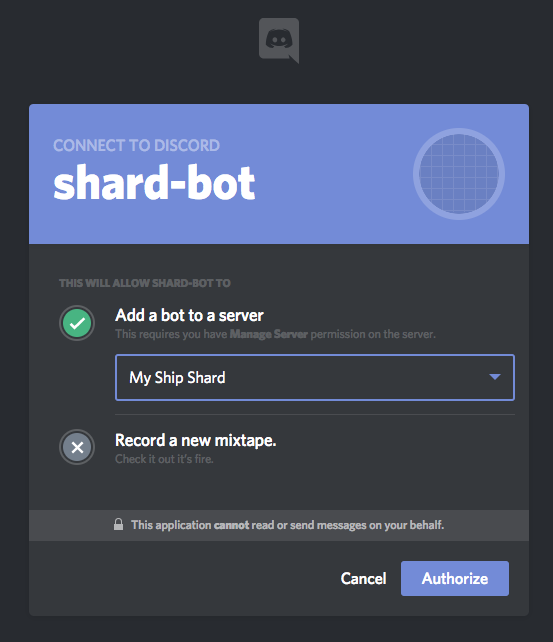
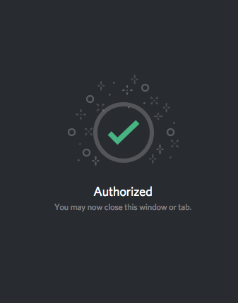
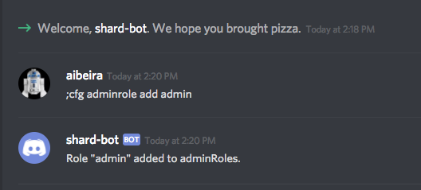
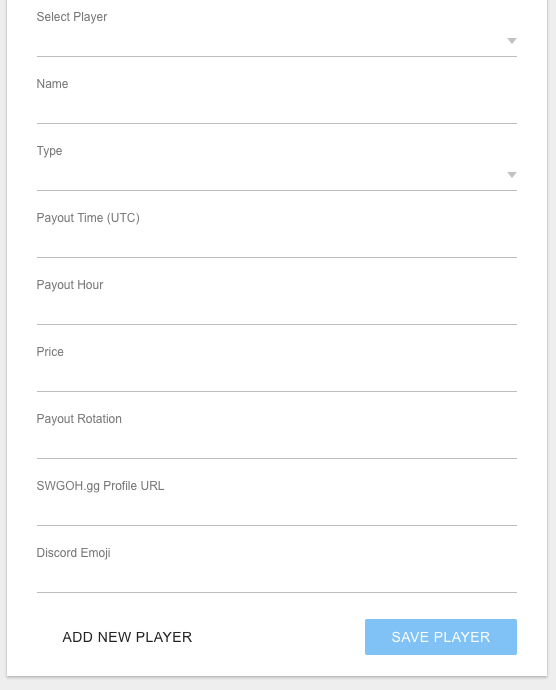
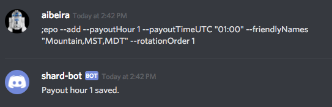
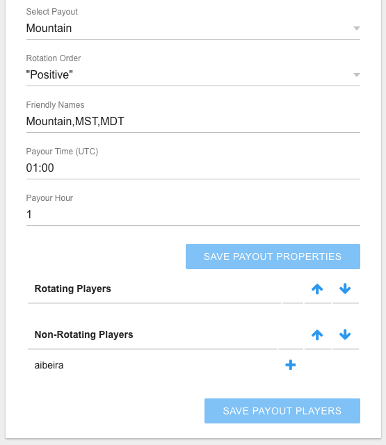
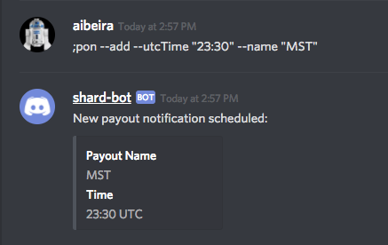

# SWGOH Shard-bot Getting Started
## General
This bot provides various tools to help with arena (fleet or squad) shards.  Primarily, this is done through data about players in the shard.  

This data includes primarily the players' names and their payout hours.  Each player can be categorized as a "friend" or an "enemy."  Any player's payout hour can be tracked, allowing for a schedule to be shown and managed.  This schedule will show which players are getting paid by hour, and organizes those players by "friend" or "enemy".  This data is displayed in channels in a Discord server, as well as at a specific webpage.  The data can be maintained by using Discord bot commands, in addition to some administrative webpages.

To begin using the bot, you need to accomplish the following tasks:

1. Add the bot to the server
0. Configure administration role
0. Add players
0. Add payouts

## Add bot to Discord server
Use the following link to add the bot to your Discord server.  You will need to be an administrator, though not the owner, of the server.

https://discordapp.com/oauth2/authorize?&client_id=347564015917989889&scope=bot&permissions=0

When this link is first hit, you will be asked to sign into Discord, if you have not already signed in.  After signing in, select the server to which you want to add the bot and hit the "Authorize" button, as seen here:

You may be asked to prove you are not a robot - just confirm that, and the bot will be authorized on your server, as confirmed by Discord like here:

## Configure adminstration role
After the bot has been added to the server, the bot needs to be configured with one or more Discord roles that contain those Discord users that will administer the bot configuration (player data, payout data, etc...)  This initial configuration can only be completed by the owner of the Discord server.  The command is as follows:

`;cfg adminrole add <admin-role-name>`

**Note:** The `<admin-role-name>` in this command needs to be replaced with the *name* of the Discord role you want to use.

The successful adding of an adminRole to the bot looks like this:

## Players
Players can be added using the administration web page, once the bot is in the server, and at least one adminRole has been configured, and add players that way.  The admin page url is: 

http://www.mralwerner.com/swgoh-shard/admin

When you access this page, you will be asked ot sign into Discord in order to retrieve a list of servers to allow you to manage the data.  Select the server you want to manage, and then click "Players".

After accessing the Players page, you will need to click the "Add Player" button at the bottom.

Fill in the required fields, and hit "Save Player."  

The following fields are required:
 
* **Name** - The player's in-game and/or Discord name.
* **Type** - The player's type - Friend or Enemy
* **Payout Time (UTC)** - The time of the player's payout in the UTC time, and in format "HH:mm".  For example, 01:00 is 1:00am UTC, or 9:00pm EDT.  
* **Payout Hour** - The hour component of the player's payout time.  This field will eventually be removed, as it can be derived, but for now, just enter the number of the hour you just put in the payout time UTC.

The other fields are optional.

* **Price** - Informational display of a "price" on an enemy player's head.  Meant to indicate the desire of the allies in the shard to have this player "hit" repeatedly until such time as they give up and stop ruining the allies fun.
* **Payout Rotation** - Indicates the order in a payout rotation for a friendly player.  This is more easily managed in the payouts administration page, after a payout has been created.
* **SWGOH.gg Profile URL** - The link to the player's swgoh.gg profile.  It will be displayed in most places the player's name is displayed in the webpage and in Discord.
* **Discord Emoji** - A Discord Emoji that will be displayed in Discord next to the players name.  It should include the leading and trailing colon (:).  For example ":flag_us:" is the emoji for the US flag and ":poop:" makes a nice emoji to be next to an enemy.

## Payouts
Payouts can only be created from Discord commands at this time.  This command will add a payout:

`;epo --add --payoutHour <payoutHour> --payoutTimeUTC <payoutTimeUTC> --friendlyNames <friendly-names-list> --rotationOrder 1`

* `<payoutTimeUTC>` - The payout time in UTC - ie, 01:00
* `<payoutHour>` - The hour component of the payout time - ie, 1
* `<friendly-names-list>` - A comma-separated list of friendly names used to refer to this payout.

**Note:** The value of the `payoutHour` is what links the players to the payouts.

For example, the following added a payout for 01:00 UTC (7:00pm MDT) with a few friendly names:

After adding payouts, you can manage them in the admin page.  You can add players to rotation, reorder the rotation, reverse the order in which rotations rotates, and cycle the rotation.  This page is accessed by clicking the "Payouts" link from the main admin page after logging in:

The payouts managment page allows for management of payouts data:

## Scheduling automatic payout notification
You can schedule the bot to dump into a specific channel the data for a specific payout at a specific time.  This command must be executed in the channel in which you wnat the notification.  The command is:

`;pon --add --utcTime <utcTime> --name <friendly-name>`  

* `<utcTime>` - the HH:mm time for the scheduled notification
* `<friendly-name>` - one of the friendly-names for the payout to be dumped

This example schedules one for 11:30pm UTC:

