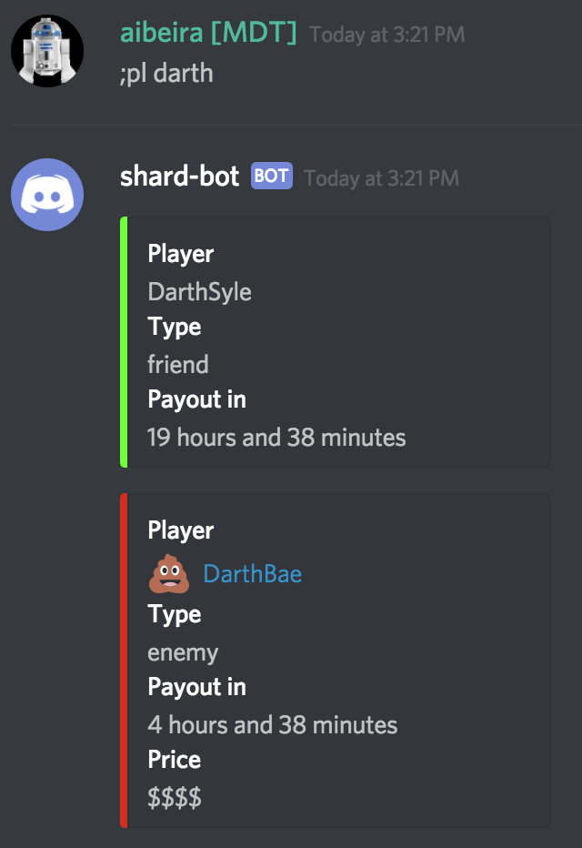
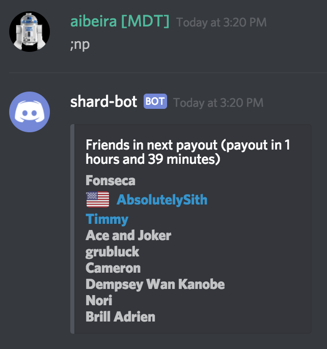
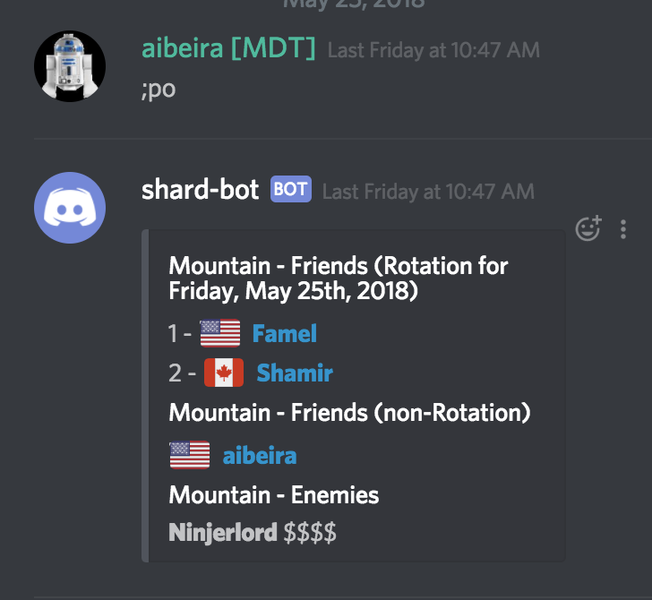

# Player Information Commands

## player (`pl`)
The `;player` command returns information about any known player whose name matches the input.

Usage: `;pl <partial-player-name>`

**Note:** `<partial-player-name>` can be either a full player name, or only a part of one.  The bot will return data about all players that match the parameter.

# Payout Information Commands
These commands provide information about payout schedules.

## next-payout (`np`)
The `;np` command lists the players (friends and enemies) in the next known payhour to occur.  It is intended to help allies avoid the next group to get paid.

Usage: `;np`

## payout (`po`)
The `;po` command lists know players (friends and enemies) in a specific hour found by specifying a friendly-name of that payout.  If no name is specified in the command, the bot will try and use the current channel's name as a friendly-name.

Usage: `;po <friendly-name>`

This example is one where the friendly-name is specified:

This example is one where the channel name is used as friendly-name:

## friends
The `;friends` command returns a list of known allies or "friend" players.  In order to control channel message pollution, this list is sent in a direct message to the Discord user that issues the `;friends` command.

Here is an example of issuing the command in a channel:

Here is an example the output received in a direct message:

## enemies
The `;enemies` command returns a list of known enemy players - or "hit list".  In order to control channel message pollution, this list is sent in a direct message to the Discord user that issues the `;enemies` command.

Here is an example of issuing the command in a channel:

Here is an example the output received in a direct message:

## all-players
The `;all-players` command returns a list of all known players - both friends and enemies.  In order to control channel message pollution, this list is sent in a direct message to the Discord user that issues the command.  The output is a merging of the `friends` and `enemies` output.

