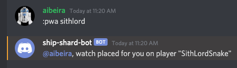
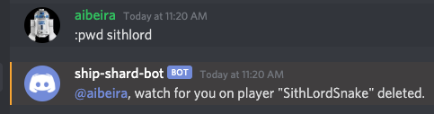
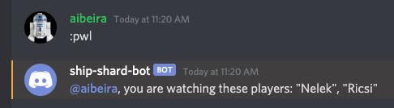

# Player Watch Commands
Discord users that have a registered ally code can use shard-bot to watch players in the shard.  When a watched player's rank changes, any watchers of that player will receive DMs indicating that they have moved.  Watches are managed for players using the follow shard-bot commands.

Below is an example of a DM for a watched player.

## player-watch-add (`;pwa`)
The `player-watch-add` command **creates** a watch on a specific player.

Usage: `;pwa <partial-name>`

`<partial-name>` - (Required) part or complete name of the player to be watched

## player-watch-delete (`;pwd`)
The `player-watch-delete` command **deletes** a watch on a specific player.

Usage: `;pwd <partial-name>`

`<partial-name>` - (Required) part or complete name of the player being watched

## player-watch-list (`;pwl`)
The `player-watch-list` command **lists** all watches for the issuer

Usage: `;pwl`

