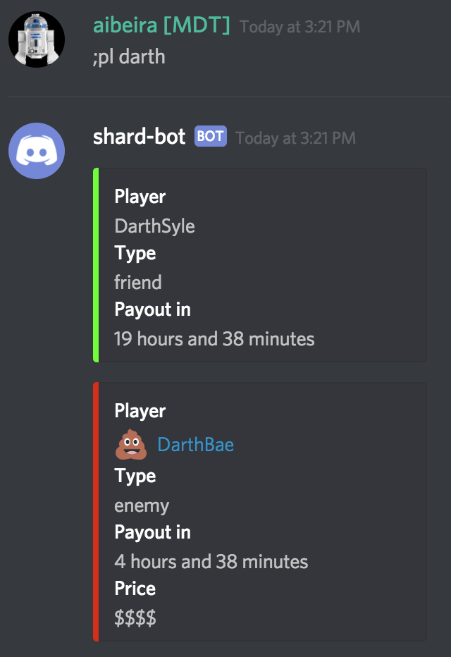
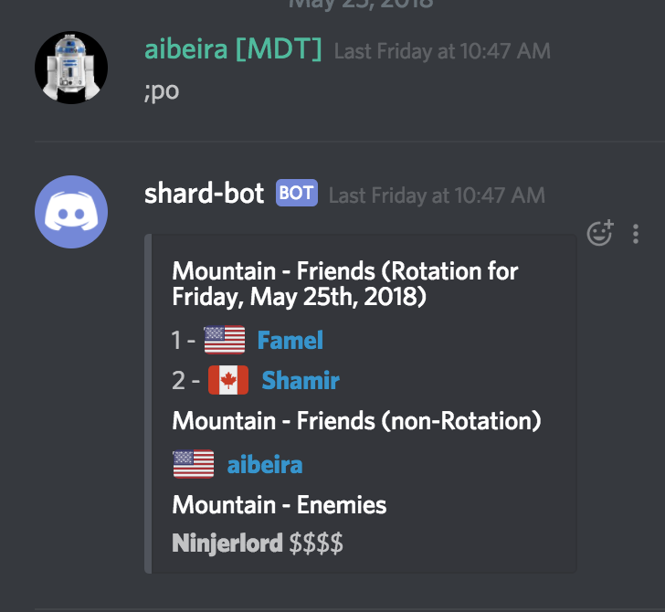
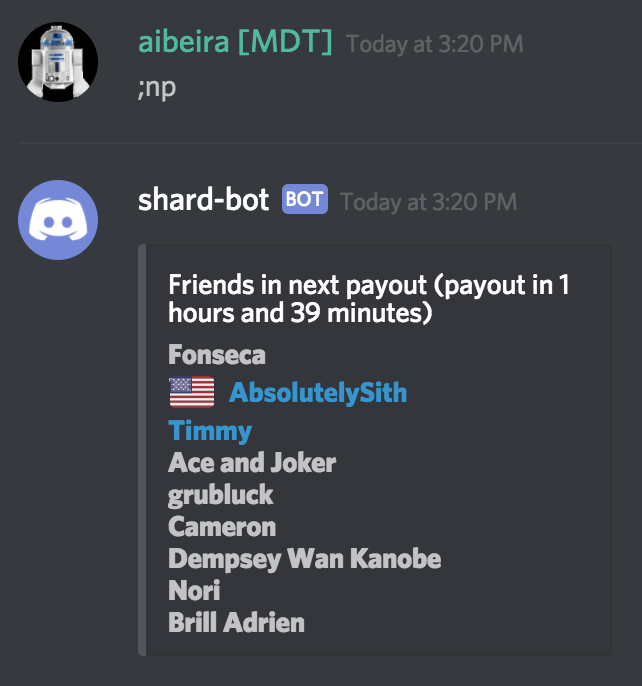
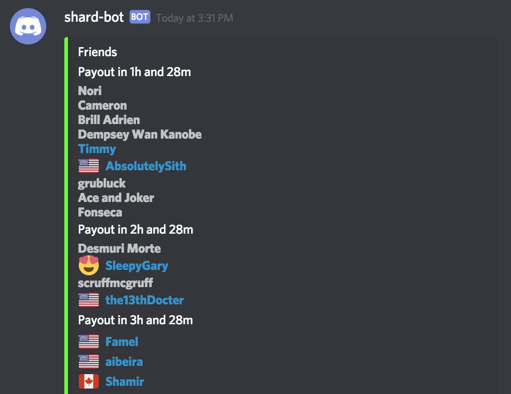
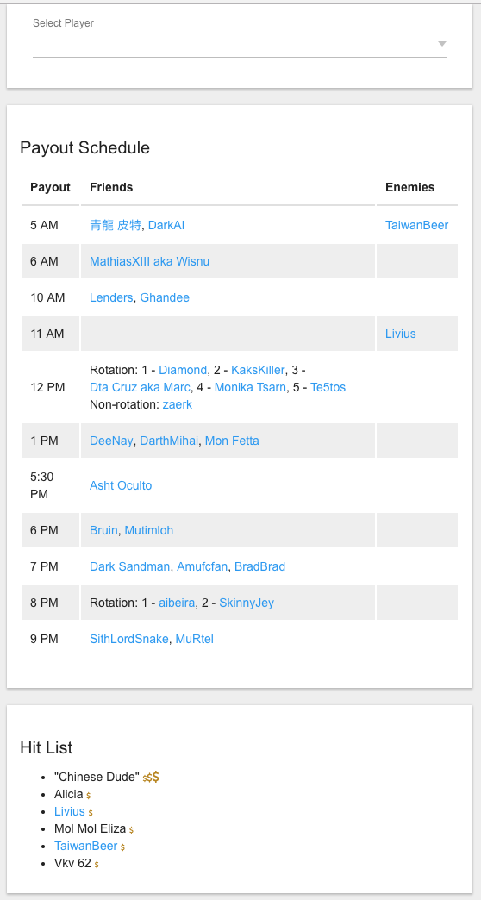

# SWGOH Shard-bot
This bot provides various tools to help with arena (fleet or squad) shards.  Primarily, this is done through data about players in the shard.  

This data includes primarily the players' names and their payout hours.  Each player can be categorized as a "friend" or an "enemy."  Any player's payout hour can be tracked, allowing for a schedule to be shown and managed.  This schedule will show which players are getting paid by hour, and organizes those players by "friend" or "enemy".  This data is displayed in channels in a Discord server, as well as at a specific webpage.  The data can be maintained by using Discord bot commands, in addition to some administrative webpages.

For help getting started, including adding the bot to your Discord server, please refer to the [Admin Guide](admin-guide.md).

For information on commands that can be used to get data and information from the bot, please refer to the [Command Guide](command-guide.md).

## Example Discord output
This bot will produce the following kinds of output about players in an arena shard in Discord:

Data about a specific player:

Data about the players in a specific payout hour:

Data about the players in the next known payout:

Data about known friend players or enemy players:

## Webpage Schedule
The same data is presented in a webpage, sorted by payout hour, with the next payout hour at the top.  The times listed are displayed in the local time of the user that accessed the web page.  Below is an example:

