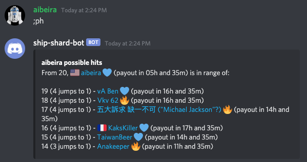
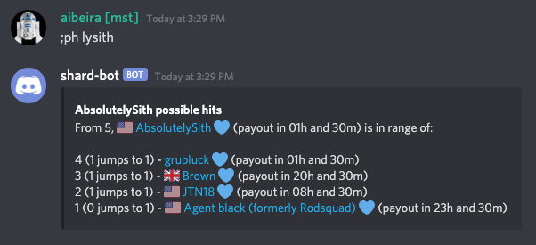
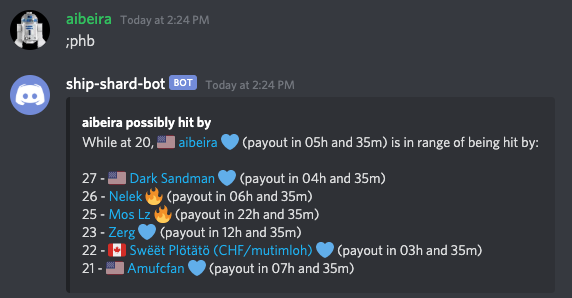
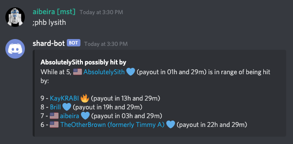

# Tracker Commands
The Arena Rank Tracker in the bot can help a player plan their jumps in arena.  This is done by tracking registered players and performing notifications of various types.  In order to use most of these commands, a given Discord user will have to register their SWGOH Ally Code with the bot.  This is done with the `player-register` command found in [Utility Commands](utility-commands.md).

_**Note:** The tracking of arena ranks is not guaranteed to be immediate, as it can take some time (usually less than two to three minutes) for the bot to become aware of a player moving._

## possible-hits (`;ph`)
This command produces a list of possible jumps that a player can make from their current arena rank.

Usage: `;ph <partial-name>`

`<partial-name>` - (Optional) part of (or the entirety of) a name of player; if omitted, the player that issued the command is assumed

## possibly-hit-by (`;phb`)
This command produces a list of players that are in range of hitting a player in their current rank.

Usage: `;phb <partial-name>`

`<partial-name>` - (Optional) part of (or the entirety of) a name of player; if omitted, the player that issued the command is assumed

