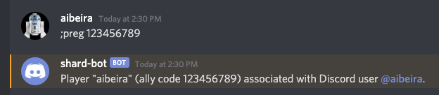
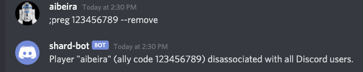
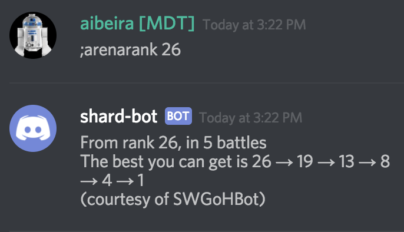
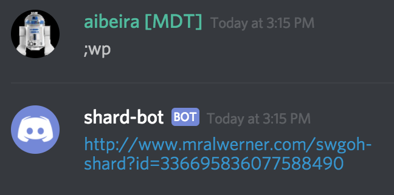

# Utility Commands

## player-register(`;preg`)
This command associates a given Discord user with a Player Ally Code.  The command is used as follows:

Usage: `;preg <ally-code> [--remove]`

`<ally-code>` - (Required) the players 9-digit SWGOH ally code.
`--remove` - (Optional) remove association between ally code and the Discord user

## arenarank
The `;arenarank` command returns information about how far you can jump in arena in five attacks.

## web-page (`wp`)

The `;wp` command can be used to retrieve a link to the web page that presents the payout schedule for the players in the shard that the bot knows about.  If you are in an administrator role, you can add the parameter `--admin` to the command to get the link to the administration pages.

## web-page-player (`wpp`)

The `;wpp` command can be used to retrieve a link to the web page that allows the player to manage their direct notification settings.
